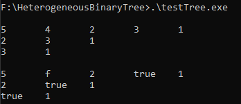

# Heterogenous BinaryTree

## Overview

This C project implements a dynamic binary tree that supports nodes capable of holding data of multiple types (integer, character, and boolean) simultaneously. The tree structure is capable of growing dynamically, allowing the addition of children to specific nodes, with the flexibility to manage both homogenous and heterogenous trees.
Features

- BinaryTree Structure: Allows for creating binary trees that can either be homogeneous (all nodes containing the same type of data) or heterogeneous (nodes containing different types of data).
- Node Structure: Nodes in the tree can store different types of data (integer, character, boolean).
- Dynamic Growth: Supports adding nodes (children) dynamically to the tree.
- Delete Subtree: Ability to delete entire subtrees.
- Viewing the Tree: Includes functionality to view the tree in a depth-first search (DFS) manner.

## Table of Contents

1. [BinaryTree Structure](#binarytree-structure)
2. [Node Structure](#node-structure)
3. [Data Structure](#data-structure)
4. [Functions Overview](#functions-overview)
    1. [Tree Functions](#tree-functions)
    2. [Node Functions](#node-functions)
5. [Example Usage](#example-usage)
6. [Screenshots](#screenshots)

### BinaryTree Structure

The binary tree is defined by the structure BinaryTree, which contains the following fields:

1. `root`: A pointer to the root node of the tree.
2. `type`: An enumeration that specifies the data type of the nodes (integer, character, boolean).
3. `isHomogenous`: A boolean indicating whether the tree is homogeneous (all nodes contain the same data type).

### Node Structure

Each node in the tree is represented by the Node structure, which contains:

1. `data`: The data of the node (of type Data).
2. `leftChild`: A pointer to the left child node.
3. `rightChild`: A pointer to the right child node.
4. `type`: Specifies the data type of the node (either integer, character, or boolean).

### Data Structure

The Data structure is used to store the data within each node. It supports three data types:
1. `integerData` (for integers),
2. `charData` (for characters),
3. `booleanData` (for boolean values).

### Functions Overview
#### Tree Functions

1. `getTree()`
Creates and initializes a new binary tree with a specified data type, either homogeneous or heterogeneous.

2. `addChildByNode()`
Adds a child node to a specific parent node.

3. `addChildByData()`
Adds a child node to a specific parent node using data instead of an existing node. The child can be added to the left or right of the parent.

4. `deleteSubtree()`
Deletes a subtree starting from a given node. You can specify whether to delete the left or right subtree.

5. `viewTree()`
Prints out the tree structure in a depth-first search (DFS) manner. BFS is not yet implemented!

#### Node Functions

1. `getNode()`
Creates a new node with the specified data and data type.

2. `printNodeData()`
Prints the data stored in a node. The function checks the data type of the node and displays the appropriate value.

### Example Usage

Below is an example of how to use the binary tree implementation:
```
void foo()
{
    struct Data data1 = {1, '1', true};
    struct Data data2 = {2, '2', true};
    struct Data data3 = {3, '3', true};
    struct Data data4 = {4, '4', true};
    struct Data data5 = {5, '5', true};

    struct BinaryTree* tree = getTree(data1, INTEGER, true);
    addChildByData(tree->root, data2, INTEGER, true);
    addChildByData(tree->root, data3, INTEGER, false);
    addChildByData((tree->root)->leftChild, data4, INTEGER, true);
    addChildByData(((tree->root)->leftChild)->leftChild, data5, INTEGER, false);
    /*
             1
            / \
           2   3
          / 
         4
         \
          5
    */
    viewTree(*tree, false);
}
```

This code creates a binary tree where the root node holds an integer, and it progressively adds nodes to form a tree structure. The viewTree() function can be used to display the tree.

### Screenshots
Output generated by running `run.bat` and current code in `main.c` viewed in DFS traversal

